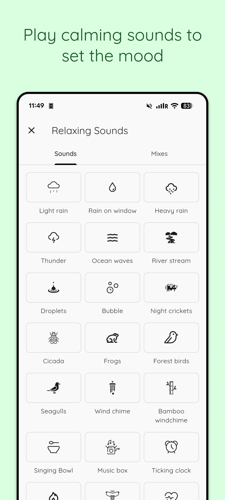
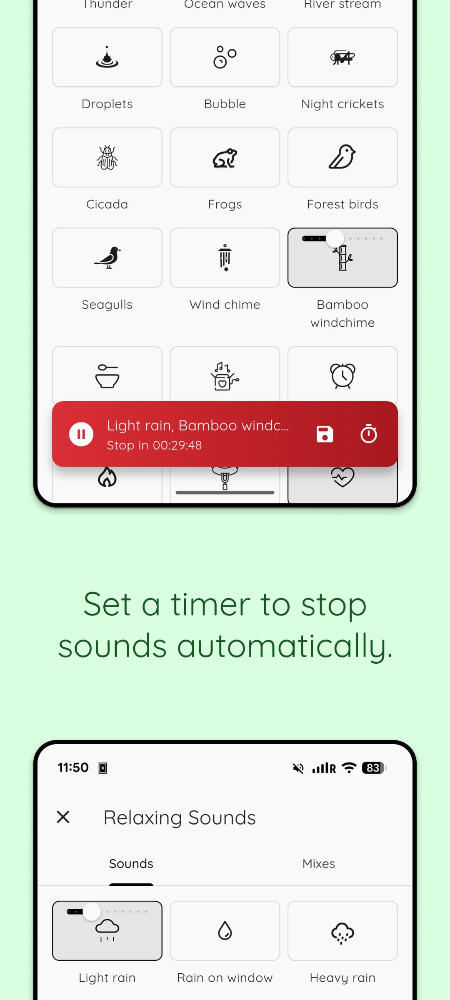
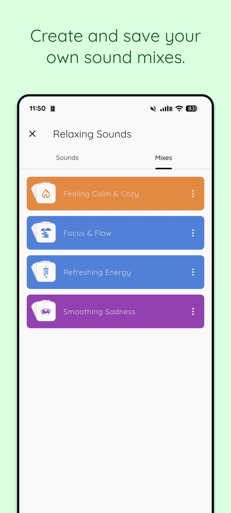
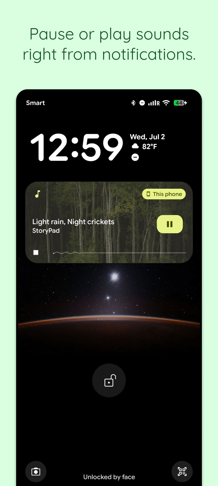

# Relaxing Sounds (StoryPad Pro)

## Description

Set the mood before you write or read. The Relaxing Sounds allows you to provide ambient audio to help you focus and create the perfect atmosphere for your writing sessions.

## Screenshots

|                                      Screenshot 1                                      |                                      Screenshot 2                                      |                                      Screenshot 3                                      |                                      Screenshot 4                                      |
| :------------------------------------------------------------------------------------: | :------------------------------------------------------------------------------------: | :------------------------------------------------------------------------------------: | :------------------------------------------------------------------------------------: |
|  |  |  |  |

## Features

### Sound Library

The library includes a variety of nature and ambient sounds:

**Nature Sounds:**

- Forest birds
- Ocean waves
- River stream
- Heavy rain
- Light rain
- Rain on window
- Thunder
- Seagulls
- Wind chime
- Bamboo windchime

**Animal Sounds:**

- Cicada
- Frogs
- Night crickets

**Activity Sounds:**

- Campfire
- Typing
- Sausage frying
- Ticking clock

**Body & Meditation:**

- Heartbeat
- Singing bowl
- Music box

**Abstract:**

- Bubbles
- Droplets

### Sound Mixing

- **Custom Mixes:** Combine multiple sounds to create your perfect ambiance
- **Volume Control:** Adjust individual sound volumes independently
- **Save Mixes:** Save your favorite combinations for quick access
- **Reorderable:** Organize your saved mixes by dragging and reordering

### Playback Features

- **Background Playback:** Sounds continue playing while you write
- **Timer:** Set a stop timer for automatic playback end
- **Notification Controls:** Control playback from system notifications
- **Persistent State:** Your mix and volume settings are remembered

## Technical Implementation

### Core Files

```
lib/
├── core/
│   ├── databases/
│   │   └── models/
│   │       ├── relax_sound_model.dart
│   │       └── relex_sound_mix_model.dart
│   ├── objects/
│   │   └── relax_sound_object.dart
│   └── services/
│       ├── multi_audio_player_service.dart
│       ├── multi_audio_notification_service.dart
│       └── relax_sound_timer_service.dart
├── providers/
│   └── relax_sounds_provider.dart
└── views/
    └── relax_sounds/
        ├── relax_sounds_view.dart
        ├── relax_sounds_view_model.dart
        └── local_widgets/
            ├── mixes_tab.dart
            ├── sounds_tab.dart
            ├── sound_icon_card.dart
            └── volume_slider.dart
```

### Key Components

**RelaxSoundsProvider** (`lib/providers/relax_sounds_provider.dart`)

- Manages audio playback state
- Handles sound selection and volume control
- Coordinates with notification service
- Manages timer functionality

**RelaxSoundsViewModel** (`lib/views/relax_sounds/relax_sounds_view_model.dart`)

- Loads and manages saved mixes
- Handles mix CRUD operations (create, rename, delete, reorder)
- Tracks downloaded sounds
- Coordinates playback with provider

**MultiAudioPlayersService** (`lib/core/services/multi_audio_player_service.dart`)

- Manages multiple simultaneous audio players
- Handles individual sound playback and volume
- Coordinates play/pause states

### Database Models

**RelaxSoundModel**

- Stores individual sound configuration
- Properties: `soundUrlPath`, `volume`

**RelaxSoundMixModel**

- Stores saved sound combinations
- Properties: `id`, `name`, `sounds`, `index`, `createdAt`, `updatedAt`
- Supports reordering via `index` field

### Audio Sources

Sound files are stored in Firebase Storage:

- Path: `/relax_sounds/`
- Categories: `activity/`, `animal/`, `body/`, etc.
- Demo images: `/add_ons_demos/relax_sounds/`

## User Flow

1. **Access:** From home, click "Music" icon → "Relaxing Sounds"
2. **Browse:** View available sounds in categorized tabs
3. **Select:** Tap sounds to add them to your current mix
4. **Adjust:** Use sliders to set individual sound volumes
5. **Play:** Control playback with play/pause button
6. **Save:** Save your custom mix for future use
7. **Manage:** View, rename, delete, or reorder saved mixes
